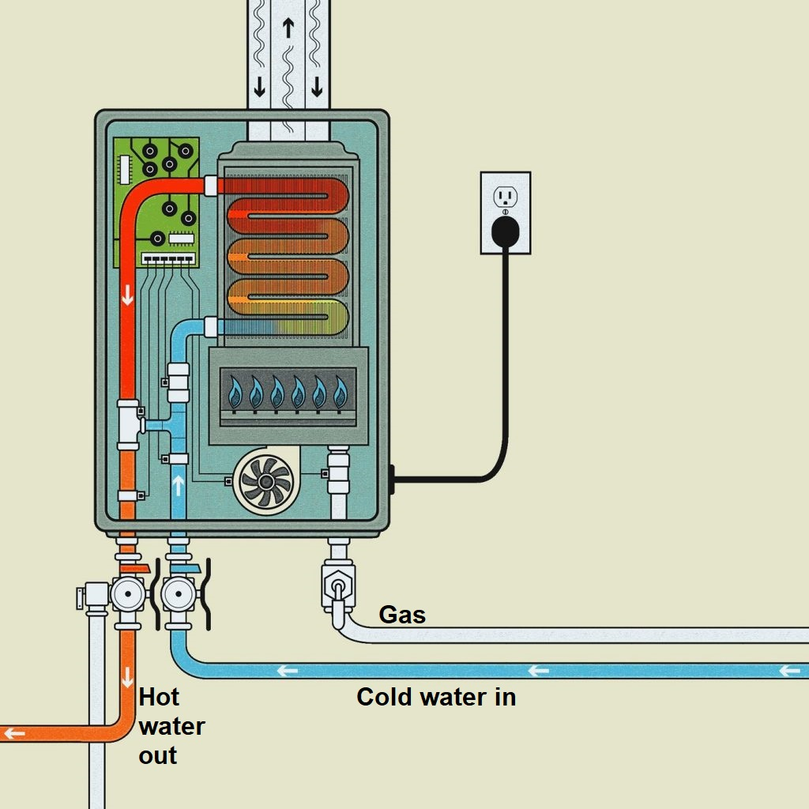
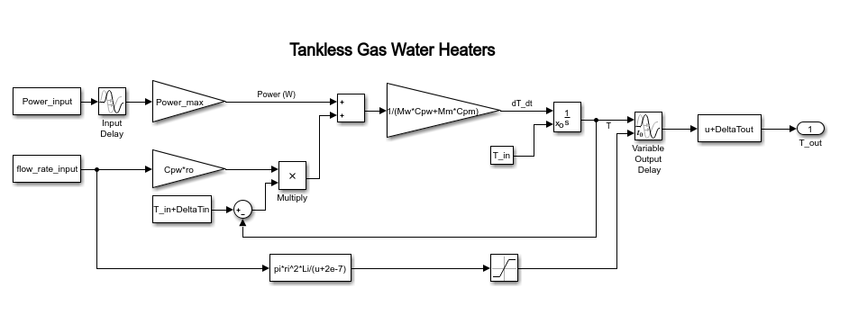
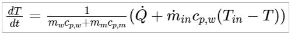
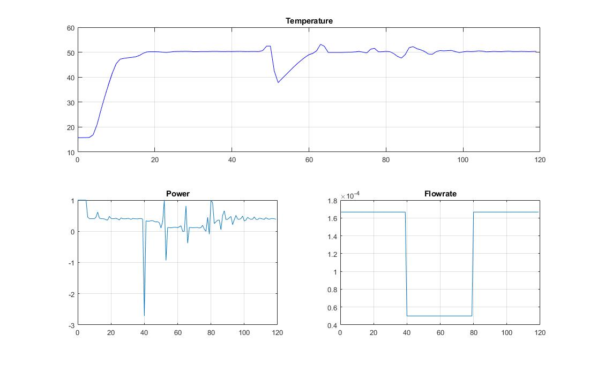
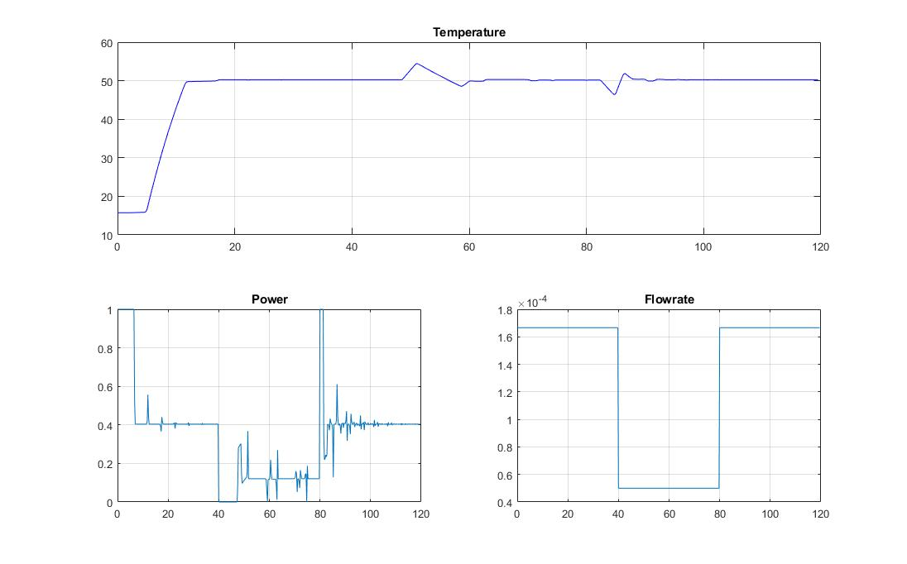

Model Predictive Control for Tankless Gas Water Heaters
================
Andres Fernando Garcia
6/9/2021

## Project details

Tankless gas water heaters (TGWH) are important systems in buildings
energy. They are the conventional method to generate heat from natural
gas in domestic hot water applications. Efficiency in this kind of
system leads to lower emissions of pollutant gases, reduces gas
consumption, and increases users’ comfort. To tackle this challenge,
this project develops a Model Predictive Control
([MPC](https://en.wikipedia.org/wiki/Model_predictive_control#:~:text=Model%20predictive%20control%20\(MPC\)%20is,oil%20refineries%20since%20the%201980s.)),
applied in a TGWH, to increase the system stability in abrupt changes in
the cold water inlet flow rate.

The system model was gotten from the article: *[“Simulation models for
tankless gas water
heaters”](https://core.ac.uk/download/pdf/275657450.pdf)*. A model was
made in Simulink to simulate the real system (see the image below). It
has two inputs: power (controller output) and cold water flow rate. The
model output is water temperature.

 The MPC model is take from the equation (15)
of the previously mentioned article:

## Methodology

There are 3 main steps to performs the MPC:

1.  Measure values
2.  Solve the Optimization Constrained Problem
3.  Update the states and the controller output

#### Measure values

In this step, you need to use the information obtained from the plant to
control. 3 values are required:

  - **The current time (*t0*):** this value is calculated in function of
    the sample period (*Ts*) and the current iteration (*k*)
  - **The manipulated variable (*u0*):** this vector contains the
    predicted thermal power in the previous iteration (the system
    input). This vector will be an initial search point in the
    optimization problem
  - **The system response (*x0*):** this value is the current state of
    the system to control (outlet temperature)

The TGWH plant needs some extra variables to simulate the real dynamics:

  - **Flow rate:** the differential equation, used in the MPC model for
    calculating the future thermal power, depends on the flow rate. The
    *Flow\_rate\_input* variable gives the current flow rate value to
    the differential equation and adapts its dynamics like the real
    system
  - **Delays:** the input and output delay are simulated using the
    variables delayed\_in and prediction

#### Solve the Optimization Constrained Problem

In this part, an optimization problem will be solved using the MPC
model. For this, a cost function is needed. In this project, the cost
function is the quadratic error between the reference signal
(Temperature = 50 degrees) and the MPC model response using the possible
Thermal power inputs. The constraints are that the thermal power (input)
varies only from 0 to 1. The predicted horizon of the MPC is given by
*Np*. The optimization function is
[fmincon](https://la.mathworks.com/help/optim/ug/fmincon.html).

#### Update the states and the controller output

The final step in every MPC iteration is to prove the predicted input in
the system to control. The program uses the Simulink model as the plant
to control. How the open-loop function includes the system delays, is
used in this part. Its response is saved in the *xmeasure* variable.

## Results

The controller responses depend on the values of *Np* and *Ts*. All
delays are multiples of the selected *Ts*. For the following images:

  - *Ts* = 0.25
  - Simulation time (*t*) = 120 seconds
  - The fixed output reference (*r*) = 50 \[°C\]
  - The flow rate units are m^3/s and the units of power are watts \[W\]

The following response corresponds to an experiment with Np = 13:

The following response corresponds to an experiment with Np = 50:

